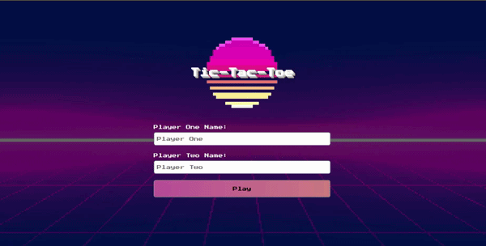

# Tic-Tac-Toe

A game of tic-tac-toe, where you can play and input your name with score system

**Link to project:** https://defalterxd.github.io/Tic-Tac-Toe/

## How It's Made:

**Tech used:** HTML, CSS, JavaScript

In this project I used what I learned and apply the concepts of closures, factory functions, private variables, module patterns and separation between DOM and core logic of the game.

The core concept was to make the game only work at console with module pattering and then only add DOM manipulation via the other module. Which incredible helps to wrap the logic around without changing a function where it could affect other functions as well (coupling).

## Lesson Learned:

In this project I learned:
<ul>
    <li>Make use of closures</li>
    <li>How to utilize the factory functions</li>
    <li>Use private variables to encapsulate my modules</li>
    <li>Make the module pattering and use of IIFE</li>
    <li>The most import is to separate the game logic with DOM logic to make it modular so we can avoid coupling them</li>
</ul>